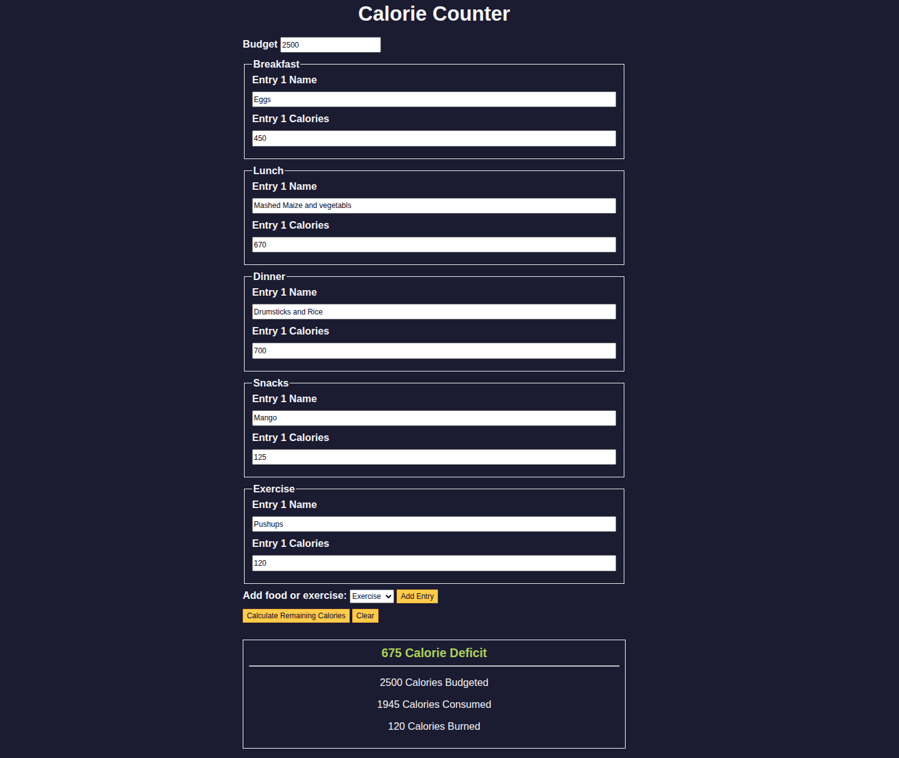

# Calorie Counter

[](https://karianjahi.github.io/calorie-counter/)
[](LICENSE)
[]()
[]()
[]()

A simple and interactive **Calorie Counter web app** that helps users track daily calorie intake and expenditure across meals and exercise.

👉 **Live Demo:** [demo](https://karianjahi.github.io/calorie-counter/)

---

## 📸 Preview



---

## 🚀 Features

- Add multiple food entries (Breakfast, Lunch, Dinner, Snacks)
- Track calories burned via Exercise
- Set a daily calorie budget
- Automatically calculates:
  - Calories consumed
  - Calories burned
  - Remaining calories (Deficit/Surplus)
- Input validation to prevent invalid values
- Clear/reset functionality

---

## 🛠️ Tech Stack

- **HTML5** – Structure
- **CSS3** – Styling (custom variables + responsive layout)
- **JavaScript (Vanilla)** – Logic & DOM manipulation

---

## 📂 Project Structure

```
calorie-counter/
│── index.html      # Main UI structure
│── styles.css      # Styling and layout
│── script.js       # App logic
│── images/
│    └── demo.png   # App preview
│── README.md
```

---

## ⚙️ How It Works

1. Set your **daily calorie budget**
2. Add entries for meals or exercise
3. Click **"Calculate Remaining Calories"**
4. View:
   - Total consumed calories
   - Calories burned
   - Remaining balance (Deficit or Surplus)

---

## ▶️ Run Locally

```bash
git clone https://github.com/karianjahi/calorie-counter.git
cd calorie-counter
open index.html
```

---

## 🧠 Key Logic Highlights

- Dynamic form entry creation using `insertAdjacentHTML`
- Input sanitization to remove invalid characters
- Prevention of scientific notation inputs (e.g., `1e5`)
- Real-time calculation of calorie balance

---

## 📄 License

This project is licensed under the MIT License.

---

## 👤 Author

**Joseph Karianjahi**

- GitHub: https://github.com/karianjahi

---

## ⭐️ Support

If you like this project, feel free to **star the repo** and share it!
